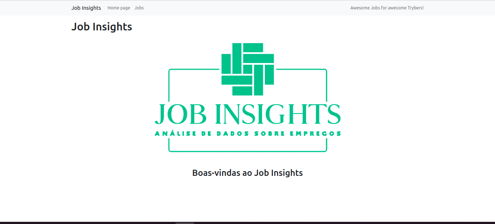
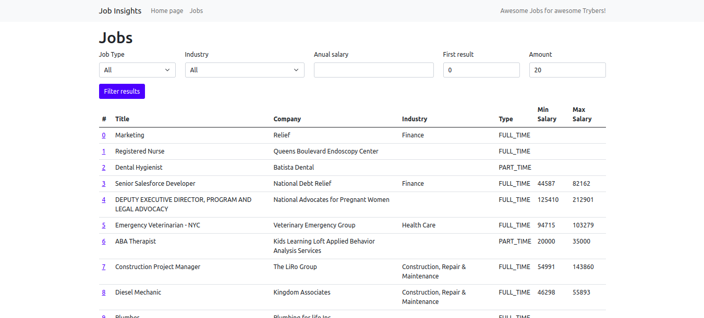
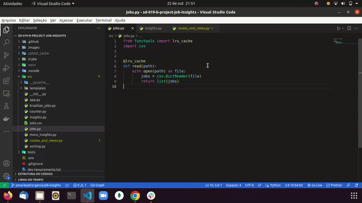

Este projeto contém os requisitos realizados por _[Anna Beatriz Garcia Trajano de Sá](www.linkedin.com/in/anna-beatriz-trajano-de-sá)_ enquanto estudava na [Trybe](https://www.betrybe.com/) :rocket:

# Project Job Insights

Neste projeto implementei análises a partir de um conjunto de dados sobre empregos. As implementações foram incorporadas 
a um aplicativo Web desenvolvido com Flask. Além disso, também desenvolvi testes utilizando o framework Pytest!

Os dados foram extraídos do site Glassdoor e obtidos através do Kaggle, uma plataforma disponiblizando conjuntos de dados para cientistas de dados.

## Python + Flask

 Job Insights - Homepage       
:-------------------------:|
  |

Job Insights - Filters       
:-------------------------:|
  |

---

## Demo



---

## Instalação do projeto localmente:
 
Após cada um dos passos, haverá um exemplo do comando a ser digitado para fazer o que está sendo pedido, caso tenha dificuldades e o exemplo não seja suficiente, não hesite em me contatar em _annagarcia@id.uff.br_ 

1. Abra o terminal e crie um diretório no local de sua preferência com o comando **mkdir**:
```javascript
  mkdir projetos
```

2. Entre no diretório que acabou de criar e depois clone o projeto:
```javascript
  cd projetos
  git clone git@github.com:annatrajano/project-job-insights.git
```

3. Acesse o diretório do projeto e depois crie um ambiente virtual para instalar todas as dependências necessárias:
```javascript
  cd project-job-insights
```

4. O Python oferece um recurso chamado de ambiente virtual, onde permite sua máquina rodar sem conflitos, diferentes tipos de projetos com diferentes versões de bibliotecas.

  1. **criar o ambiente virtual**

  ```bash
  $ python3 -m venv .venv
  ```

  2. **ativar o ambiente virtual**

  ```bash
  $ source .venv/bin/activate
  ```

  3. **instalar as dependências no ambiente virtual**

  ```bash
  $ python3 -m pip install -r dev-requirements.txt
  ```

  Com o seu ambiente virtual ativo, as dependências serão instaladas neste ambiente.
  Quando precisar desativar o ambiente virtual, execute o comando "deactivate". Lembre-se de ativar novamente quando voltar a trabalhar no projeto.


## Habilidades Desenvolvidas

Neste projeto, desenvolvi as seguintes habilidades:

 - Utilizar o terminal interativo do Python.
 - Utilizar estruturas condicionais e de repetição.
 - Utilizar funções built-in do Python.
 - Utilizar tratamento de exceções.
 - Realizar a manipulação de arquivos.
 - Escrever funções.
 - Escrever testes com Pytest.
 - Escrever seus próprios módulos e importá-los em outros códigos.


 
 ## Referências
 [Documentação Oficial - Python](https://docs.python.org/3/)<br>
 [Working With Files in Python](https://realpython.com/working-with-files-in-python/)<br>
 [Pytest](https://docs.pytest.org/en/7.1.x/contents.html)<br>
 [Conventional Commits](https://gist.github.com/qoomon/5dfcdf8eec66a051ecd85625518cfd13)<br>

 ## Escopo do Projeto
 
 ### 1 - Implemente a função `read`
 ### 2 - Implemente a função `get_unique_job_types`
 ### 3 - Implemente a função `get_unique_industries`
 ### 4 - Implemente a função `get_max_salary`
 ### 5 - Implemente a função `get_min_salary`
 ### 6 - Implemente a função `filter_by_job_type`
 ### 7 - Implemente a função `filter_by_industry`
 ### 8 - Implemente a função `matches_salary_range`
 ### 9 - Implemente a função `filter_by_salary_range`
 ### 10 - Implemente um teste para a função `count_ocurrences`
 ### 11 - Implemente um teste para a função `read_brazilian_file`
 ### 12 - Implemente um teste para a função `sort_by`
 ### 13 - (`Bônus`) Implemente a página de um job
